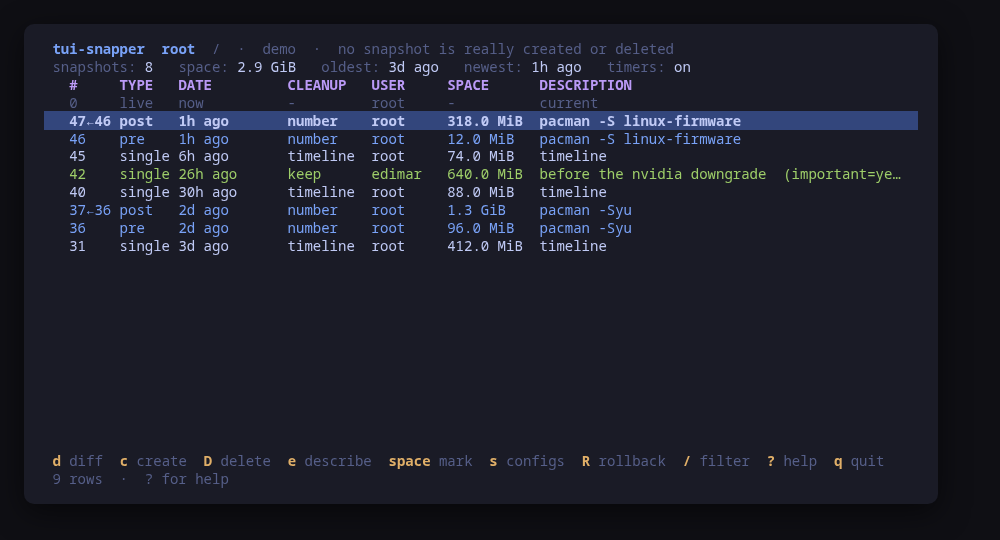
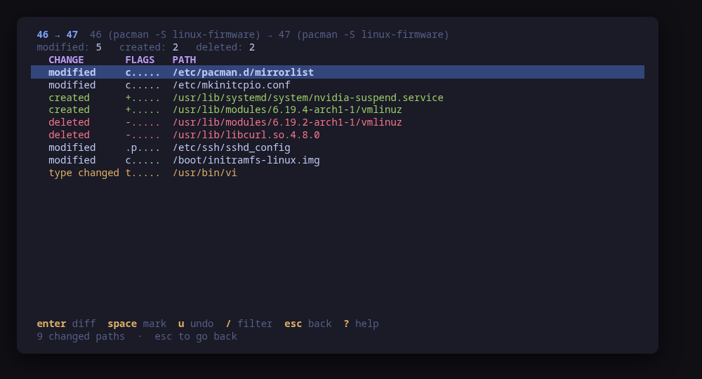
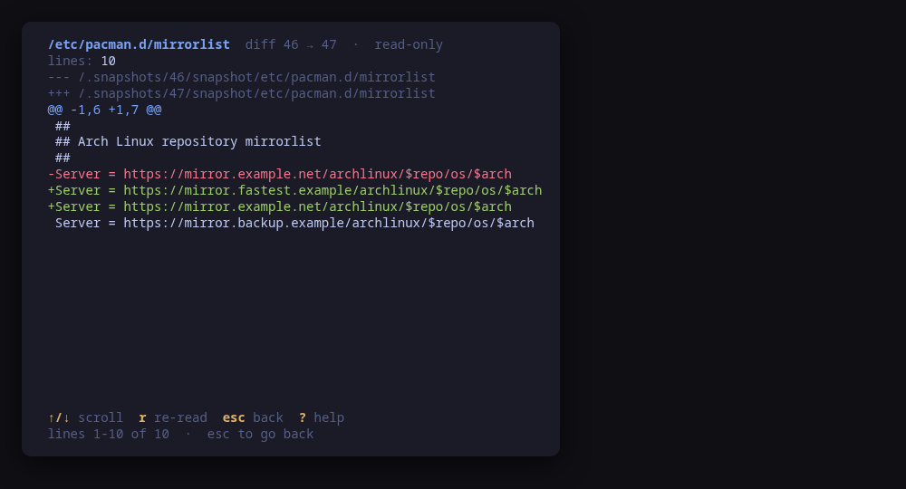
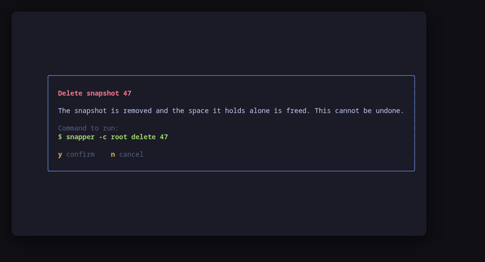
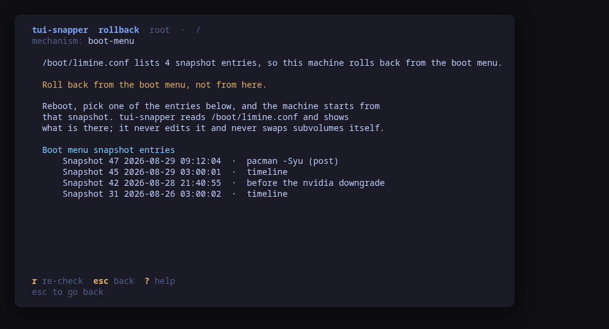
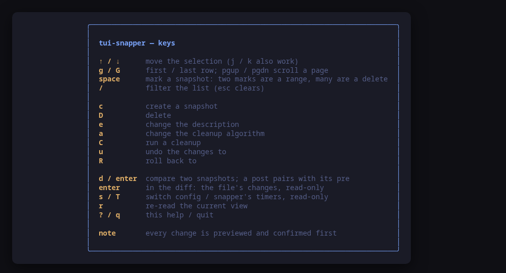

[](https://scorecard.dev/viewer/?uri=github.com/tui-tools/tui-snapper)
[](https://www.bestpractices.dev/projects/14368)

> **Beta.** The family is days old and still changing. Package names, flags
> and keys may move without notice until 1.0. Pin versions, and report what
> breaks.

# tui-snapper

btrfs snapshots, managed by [snapper](http://snapper.io/), from the terminal.
Part of the [tui-tools](https://github.com/tui-tools) family.

Your machine has been taking snapshots before every package upgrade for
months. `snapper list` prints them; answering "what did that upgrade actually
change, and can I put back just this one file" from there is a different
matter. That is what this is for.





```sh
make demo     # the whole UI, on sample data, with no btrfs and no root
```

```console
sudo tui-snapper                  # drive the machine's snapper
tui-snapper --demo                # sample snapshots, no btrfs and no root
sudo tui-snapper --check          # read snapper, print JSON, exit
tui-snapper --report              # print what a bug report needs, exit
```

## Install

<!-- install:start -->
<!-- Generated by tui-kit/tools/render-install.py from tool.json. -->
<!-- Edit the manifest, then run `make readme`. -->

### Arch Linux

Needs the tui-tools repository, which is a [one-time
setup](https://tui.tools/install/).

The one-liner detects the distribution and adds the repository and its signing
key:

```sh
curl -fsSL https://pkgs.tui.tools/install.sh | sh
```

Piping a script into a shell is not this family's style, so here is the same
setup by hand — read it, or read the script first with `curl -fsSL
https://pkgs.tui.tools/install.sh -o install.sh`:

```sh
curl -fsSL -o /tmp/tui-tools.asc https://pkgs.tui.tools/pubkey.asc
sudo pacman-key --add /tmp/tui-tools.asc
sudo pacman-key --lsign-key \
  "$(gpg --show-keys --with-colons /tmp/tui-tools.asc | awk -F: '/^fpr:/{print $10; exit}')"
printf '[tui-tools]\nServer = https://pkgs.tui.tools/arch/$arch\n' \
  | sudo tee -a /etc/pacman.conf
sudo pacman -Sy
```

Then, and for every other tool in the family:

```sh
sudo pacman -S tui-snapper
```

Upgrades then arrive with the rest of your system updates.

### Debian and Ubuntu

Needs the tui-tools repository, which is a [one-time
setup](https://tui.tools/install/).

The one-liner detects the distribution and adds the repository and its signing
key:

```sh
curl -fsSL https://pkgs.tui.tools/install.sh | sh
```

Piping a script into a shell is not this family's style, so here is the same
setup by hand — read it, or read the script first with `curl -fsSL
https://pkgs.tui.tools/install.sh -o install.sh`:

```sh
sudo install -d -m 0755 /etc/apt/keyrings
curl -fsSL https://pkgs.tui.tools/pubkey.asc \
  | sudo gpg --dearmor -o /etc/apt/keyrings/tui-tools.gpg
echo "deb [signed-by=/etc/apt/keyrings/tui-tools.gpg] https://pkgs.tui.tools/deb stable main" \
  | sudo tee /etc/apt/sources.list.d/tui-tools.list
sudo apt update
```

Then, and for every other tool in the family:

```sh
sudo apt install tui-snapper
```

Upgrades then arrive with the rest of your system updates.

### Fedora and RHEL

Needs the tui-tools repository, which is a [one-time
setup](https://tui.tools/install/).

The one-liner detects the distribution and adds the repository and its signing
key:

```sh
curl -fsSL https://pkgs.tui.tools/install.sh | sh
```

Piping a script into a shell is not this family's style, so here is the same
setup by hand — read it, or read the script first with `curl -fsSL
https://pkgs.tui.tools/install.sh -o install.sh`:

```sh
sudo rpm --import https://pkgs.tui.tools/pubkey.asc
sudo curl -fsSL -o /etc/yum.repos.d/tui-tools.repo https://pkgs.tui.tools/rpm/tui-tools.repo
sudo dnf makecache
```

Then, and for every other tool in the family:

```sh
sudo dnf install tui-snapper
```

Upgrades then arrive with the rest of your system updates.

### Any distribution, static binary

```sh
curl -fsSL https://github.com/tui-tools/tui-snapper/releases/download/v0.2.1/tui-snapper_0.2.1_linux_amd64.tar.gz | tar -xz tui-snapper
sudo install -m0755 tui-snapper /usr/local/bin/tui-snapper
```

Static, no runtime dependencies beyond the snapper binary it drives.

### From source

```sh
git clone https://github.com/tui-tools/tui-snapper
cd tui-snapper && make demo
```

make demo needs no btrfs filesystem and no root.

Not packaged for these yet; the static binary works everywhere in the meantime.

### openSUSE — coming soon

Needs the tui-tools repository, which is a [one-time
setup](https://tui.tools/install/).

```sh
sudo zypper install tui-snapper
```

The rpm repository is shared with dnf; zypper support is not tested yet.

### Verify a download

Every release of `tui-snapper` ships a `checksums.txt`. Check an archive
against it before installing:

```sh
sha256sum -c checksums.txt --ignore-missing
```

Website: https://tui.tools/tools/tui-snapper/
<!-- install:end -->

## What it does

**The history.** Every config's snapshots, newest first: the hourly timeline
ones, the pre/post pairs your package manager left behind — a post snapshot
shows the pre it belongs to, `47←46` — and the ones you took by hand. A
snapshot no cleanup algorithm will ever remove is colored as kept, because
that is the difference between a state you can rely on and one a timer will
quietly take away. The header carries the config, its subvolume, how far back
the history goes, and the space the snapshots hold when btrfs quotas make that
figure real.

**What changed.** `d` compares two snapshots. A post snapshot pairs with its
own pre without being asked, which is the comparison anyone opening a package
upgrade wants; mark two snapshots with `space` to compare any other pair.
`enter` on a path opens its unified diff, read-only and scrollable.



**Putting things back.** `u` in the diff view runs `undochange` for the
selected paths, or for every path you marked. One configuration file goes back
without the rest of the filesystem moving.

**Managing the history.** Create a snapshot with a description, a type and a
cleanup algorithm; delete one, or every snapshot you marked; change a
description; pin a snapshot by clearing its cleanup algorithm; run `number`,
`timeline` or `empty-pre-post` cleanup. Every one of them is shown as the
exact `snapper` command line first.



**The configs themselves.** `s` opens the config screen, and it is no longer
only a picker. `n` creates a config for a subvolume: type the path, the tool
checks that it exists and is on a mounted btrfs filesystem before going on,
suggests the name that path usually gets, and previews
`snapper -c <name> create-config -f btrfs <subvolume>`. `a` on a config edits
its retention limits — `NUMBER_LIMIT`, `NUMBER_LIMIT_IMPORTANT`,
`TIMELINE_CREATE`, the five `TIMELINE_LIMIT_*` keys and
`EMPTY_PRE_POST_CLEANUP` — seeded from `snapper get-config`, so the form opens
on what the machine actually says. Only the keys you changed are written, and
no key outside that list is ever touched. `D` deletes a config, and asks for
the config's name to be typed out first; the `root` config is refused
outright, because its history is also what a limine boot menu offers for a
rollback.

A machine where snapper manages nothing at all opens on that screen too — the
one case where "there is nothing to show" and "there is something to do about
it" are the same screen.

**Rollback, honestly.** This is the one thing that genuinely differs between
machines, so the tool works out which mechanism is in front of you instead of
assuming:

- where `snapper rollback` is the real mechanism — the config is the root
  filesystem and snapper carries the `rollback` flag — it is offered, with the
  warning it deserves;
- on an **Omarchy** or **limine-snapper-sync** layout, the snapshots are in
  the boot menu and booting one *is* the rollback. tui-snapper reads
  `/boot/limine.conf` and shows those entries read-only. It never edits that
  file, and it never swaps subvolumes itself.



**The timers, read-only.** `T` shows whether `snapper-timeline.timer` and
`snapper-cleanup.timer` are running and enabled, which is the answer to "why
did nothing get cleaned up". Turning them on and off is systemd's job, and
[tui-systemd](https://github.com/tui-tools/tui-systemd) already does it.

## It needs root, including to read

Most tools in this family read as an ordinary user and escalate only to change
something. snapper does not work that way: it opens its subvolumes directly,
so even `snapper list` fails for a non-root user with

```
IO error (open failed path:/ errno:1 (Operation not permitted)).
```

So either run the whole thing with `sudo tui-snapper`, or leave
`sudo = "sudo -n"` configured and keep a sudo timestamp warm — every snapper
call is then escalated individually. The tool says which of the two it is
doing in its header, and explains this failure rather than showing you an
empty list. `--demo` needs neither.

## Keys

| Key | What it does |
| --- | --- |
| `↑` `↓` `j` `k` | move the selection; `g` / `G` first and last, `pgup` / `pgdn` a page |
| `space` | mark a snapshot: two marks are a range, many are one delete |
| `d` / `enter` | compare two snapshots; a post snapshot pairs with its own pre |
| `enter` | in the diff: that file's changes, read-only |
| `u` | in the diff: put the selected or marked files back |
| `c` | create a snapshot: description, type, cleanup algorithm |
| `D` | delete the selected snapshot, or every marked one |
| `e` / `a` | change the description / the cleanup algorithm |
| `C` | run a cleanup: `number`, `timeline` or `empty-pre-post` |
| `R` | rollback, or how this machine actually rolls back |
| `s` / `T` | the config screen / snapper's timers, read-only |
| `/` | filter the list |
| `r` | re-read the current view |
| `?` / `q` | help / quit |

On the config screen (`s`), three keys act on the configuration itself:

| Key | What it does |
| --- | --- |
| `enter` | open that config's snapshots |
| `n` | create a config for a subvolume, checked before it is previewed |
| `a` | change that config's retention limits, seeded from `get-config` |
| `D` | delete that config, after its name is typed out; `root` is refused |



## Configuration

`/etc/tui-snapper/config.toml`, then `~/.config/tui-snapper/config.toml`, then
`TUI_SNAPPER_*` in the environment, then the flags. See
[examples/config.toml](examples/config.toml).

```toml
config = "root"                    # the snapper config to open on
sudo = "sudo -n"                   # "" runs snapper directly
boot-config = "/boot/limine.conf"  # where the rollback screen reads the boot menu
no-dbus = false                    # true where no snapperd is running
theme = ""                         # empty follows the active Omarchy theme
```

`no-dbus` is worth knowing about. snapper normally talks to `snapperd` over
D-Bus; in a container, a chroot or a rescue shell there is no snapperd, and
every command comes back as
`Failure (org.freedesktop.DBus.Error.FileNotFound)`. `--no-dbus` makes snapper
do the work itself. The flag becomes part of the previewed command line, so
the dialog still shows exactly what will run.

## Compatibility

<!-- compat:start -->
<!-- Generated by tui-kit/tools/render-compat.py from tool.json. -->
<!-- Edit the manifest, then run `make readme`. -->

`tui-snapper` probes its backend once at startup and shows the version in the
header. A version nobody has tested is marked `(untested)` there rather than
hidden; one below the minimum is marked as such and the tool still runs.

### snapper

| | |
| --- | --- |
| Binary | `snapper` |
| Version read with | `snapper --version` |
| Minimum | 0.8.6 |
| Tested | `0.10.6`, `0.13.0`, `0.13.1` |
| Version-gated features | `undochange-root-paths` (since 0.10.6) |

| Versions | What changes |
| --- | --- |
| `<0.8.6` | snapper has no `--jsonout`, and both the config list and the snapshot list are read as JSON, so nothing can be listed at all |
| `<0.10.6` | `snapper undochange` cannot recreate a path that sits directly under the subvolume root, so putting back a deleted top-level file or directory fails with "failed to create" |
| `<0.10.7` | `snapper diff` is broken for LVM-based configs, so the file view comes back empty there even when the compare screen lists the change |

The tested versions are generated from `compat/results.jsonl`, which the tool's
own smoke test appends to when it runs against a real machine in
[tui-lab](https://github.com/tui-tools/tui-lab).
<!-- compat:end -->

## The rules it keeps

These are the family's, and they are what the tests are about:

- **Preview, then confirm.** Nothing changes without the exact `snapper`
  command line being shown first. The dialog is the only path to a mutation,
  and `internal/snapper/command.go` is the only place a command line is built.
- **Read-only by default.** Starting the tool only reads.
- **No daemon, no state of its own.** The filesystem is the source of truth,
  and it is re-read after every change.
- **`--demo` always works.** It builds and previews every command for real and
  touches nothing.
- **Backend behind an interface.** The UI never names a binary.
- **Responsive.** It works in a 40-column pane and on a full screen.

## Development

```sh
make check         # gofmt, go vet, tests
make demo          # the UI on sample data
make screenshots   # re-render the README frames from --demo
make manifest      # validate tool.json against the family schema
make compat        # harvest tui-lab results into compat/results.jsonl
make readme        # regenerate the Install and Compatibility sections
```

The parsers are table-tested against output captured from a real snapper
0.13.1 on a real btrfs filesystem — `internal/snapper/testdata` holds those
captures verbatim, including
`testdata/limine-omarchy-server.conf`: a `/boot/limine.conf` taken from an
Omarchy Server 4.0.1 VM after four `snapper create` calls and one
`limine-snapper-sync` run. The three layouts in `limine_test.go` beside it are
reconstructions rather than captures, and say so: they were rebuilt from the
writer that produces them and from limine's own `CONFIG.md`. The capture
corrected one of them — the titles that machine generates are
`4 │ 2026-08-29 21:27:27`, the snapshot number first and then the timestamp,
and not the timestamp alone.

Three things worth knowing if you extend a parser:

- `snapper status` is **plain text even under `--jsonout`** in 0.13.1, so it
  is parsed line by line while `list` and `list-configs` are read as JSON;
- `snapper --jsonout list` keys its array by **the config's own name**, not by
  a fixed field, so `{"root": [...]}` is what comes back;
- `/boot` is **mode 0700** on an Omarchy install, so reading `limine.conf`
  needs the same escalation the snapper calls use. A tool that opens it
  directly finds nothing and then reports the wrong rollback mechanism, which
  is what `tui-lab` caught.

### `--check`

`--check` is the non-interactive read path, the same one `tui-firewall` and
`tui-systemd` have. It drives the real backend, prints the parsed model as
JSON and exits 0 or 1. It never builds and never runs a mutation, so it is
safe anywhere.

```console
$ sudo tui-snapper --check | head -9
{
  "tool": "tui-snapper",
  "version": "dev",
  "backend": "snapper",
  "describe": "snapper via /usr/bin/sudo -n",
  "config": "root",
  "subvolume": "/",
  "configs": 1,
  "config_list": [
```

That is what makes assertions like "the tool's snapshot count equals
`snapper list`'s" possible, and it is what `test/smoke.sh` runs on each of the
lab's three machines.

### `--report`, for bug reports

`--report` prints, in one block, everything a maintainer has to ask for
otherwise: the tool and kit versions, the backend and the version probed off
it, the distribution, the kernel, the terminal, the theme, the escalation
prefix, whether the running binary came from a package, and the three settings
that decide what every snapper command line looks like — the config it opens
on, `no-dbus`, and where the boot menu is read from. It needs no privileges
and reads no snapshot, so it works on the machine where the bug is — including
one with no snapper installed at all, where the selection error is itself one
of the lines.

```console
$ tui-snapper --report
tui-snapper 0.1.3 (kit v0.2.9)
backend: snapper 0.13.1
mode: live
distro: omarchy-server 4.0.1 (Omarchy Server)
kernel: 6.19.14-1-default
arch: x86_64
locale: en_US.UTF-8
term: xterm-256color
theme: tokyo-night
sudo: sudo -n
root: no
binary: /usr/bin/tui-snapper (packaged)
snapper config: (first on the machine)
no-dbus: no
boot config: /boot/limine.conf
```

The block is written to be published as it is: it carries no hostname, user
name, home path or address, and no environment variable beyond `LANG`,
`LC_ALL`, `TERM` and `TERM_PROGRAM`. A binary living under your home directory
is reported as being there without naming the path, and so is a boot
configuration you have pointed somewhere private. `--report` works with
`--demo` too, where it says so on the `mode` line.

The bug form asks for this block first — see
[`.github/ISSUE_TEMPLATE/bug_report.yml`](.github/ISSUE_TEMPLATE/bug_report.yml).

## Contributing

Contributions arrive as pull requests, and the guide the whole family follows is
[CONTRIBUTING.md](https://github.com/tui-tools/tui-kit/blob/main/CONTRIBUTING.md)
in tui-kit: it covers the branch, the checks a change has to pass and how the
commits are written. A vulnerability goes to
[SECURITY.md](https://github.com/tui-tools/tui-kit/blob/main/SECURITY.md)
instead, never into a public issue.

## License

MIT — see [LICENSE](LICENSE). Part of the
[tui-tools](https://github.com/tui-tools) family.
